# Zibo-Environment
Step by Step description of the must have X-Plane 12 plugins to be used with Zibo B737-800

## Introduction
This guide is intended for the fellow simmers willing to use the Zibo B737-800 at its full capabilities, and maximum achievable realism.
I'll try to cover each and every step from installation to configuration of the aircraft and all needed / desirable plugins.
It is meant to be a *developing project* in time.

## Prerequisites
- X-Plane 12 installed. At the time this guide is written / updated, current version is **12.4-beta1**.
- graphic settings / performances are beyond the concern of this guide, there are many other resources available to optimize X-Plane depending on hardware specs
- to simplify debugging and preserve sanity I would recommend to travel light, removing any custom scenery / scenery enhancement and any plugin from the plugin folder (and any addon related to plugins in plugin folder).\
Once everything is working as expected at the end of this journey, you will be able to add everything else and monitor.\
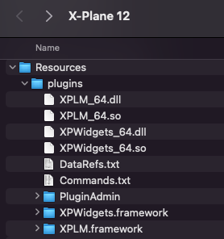
- Zibo B737-800X: correct installation of Zibo aircraft is beyond the concern of this guide, there are many other resources available to archive it, and some softwares able to manage updates in some operating systems.\
I personally manage installation and updates manually, I rather think this is the best way to keep track of everything that's happening, but of course YMMV.\
Python scripts will detect Zibo and LevelUp aircraft based on the filepath, so _B737-800X_ or _LevelUp_ need to be present. I use this organization:
    ```
    - X-Plane 12
        - Aircraft
            - LevelUp
                - 737NG Series V2
            - Zibo Mod
                - B737-800X
    ```
    At the time this guide is written / updated, current version is **4.05.14**.
- ability to whitelist / exclude plugin folder from quarantine check on your OS
- a [Hoppie's ACARS logon](https://www.hoppie.nl/acars/system/register.html).\
you need to register, and you'll get a LOGON code by email 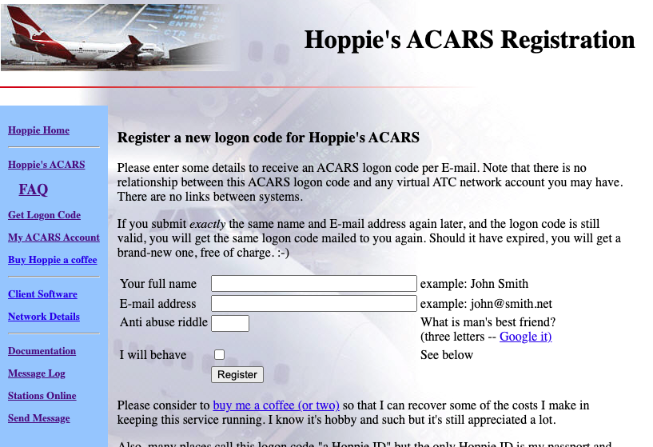

## Addons
This are the packets we need to download to create the perfect (in my opinion) environment to use Zibo at its maximum potentiality:

## Python plugins

1. ### XPPython3
    this is the foundation of the whole structure. Since version 4.5.x it does not rely on Python installation on the Host OS, so installation became straight forward:
    - [download the stable version](https://xppython3.readthedocs.io/en/latest/usage/installation_plugin.html#) **for your OS** from the plugin website
    - unzip the packet and move XPPython3 folder to X-Plane 12 plugin folder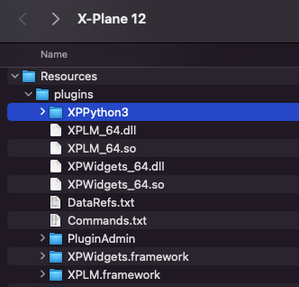.\
    If your OS requires, remove Antivirus check on plugin folder
    - >[!IMPORTANT]\
    start X-Plane 12 and let XPPython3 download all the needed libraries. It will notify when it's done. You can then close X-Plane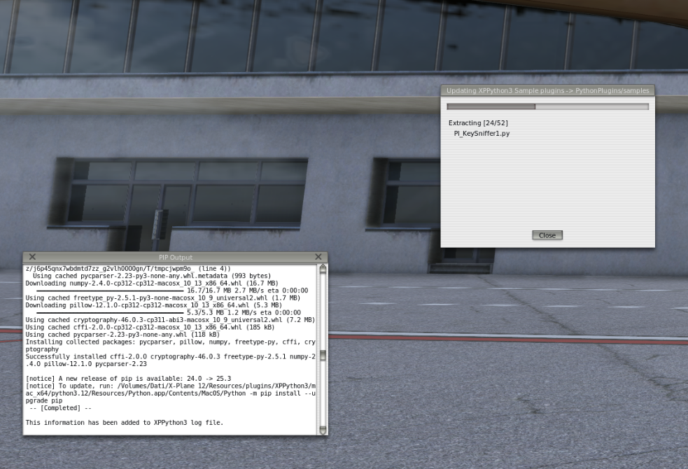\
    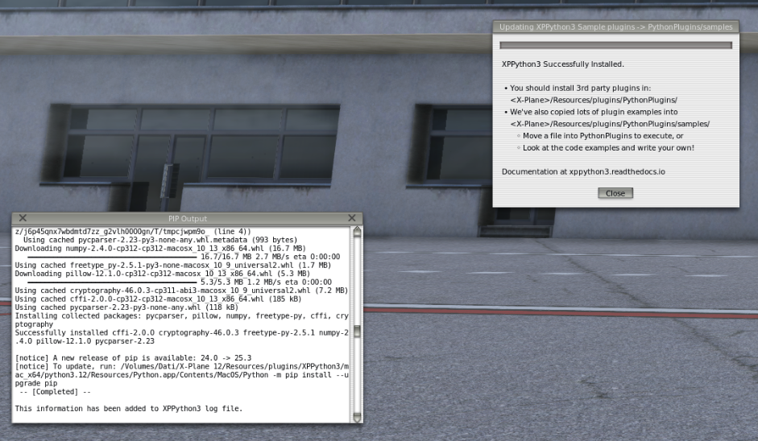
    - XPPython3 should have created a _PythonPlugins_ folder in X-Plane plugin folder. That is where all python scripts need to be installed\
    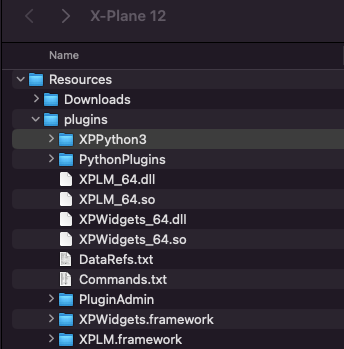

2. ### HoppieBridge script
    this script is necessary for Zibo CPDLC capabilities to work
    - [download latest stable version](https://github.com/biuti/HoppieBridge/releases)
    - unzip the archive and move the file _PI_HoppieBridge.py_ to the PythonPlugins folder (that's the only file in the zip file you need)\
    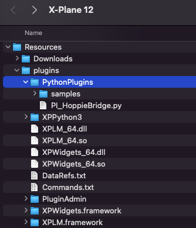
    - launch X-Plane 12, open the HoppieBridge monitor from the plugin menu, insert the LOGON code you received by mail from Hoppie's ACARS, and click save\
    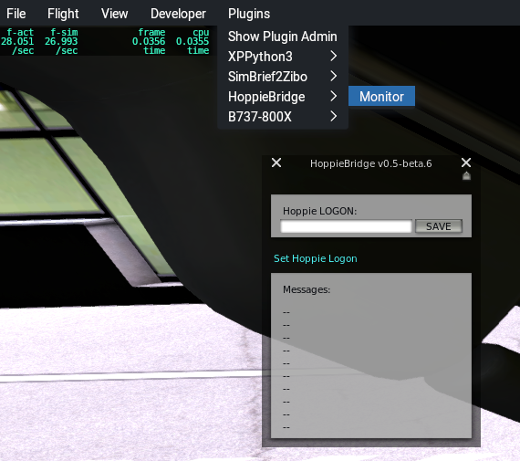
    - HoppieBridge will connect automatically each time X-Plane starts, if all conditions are met, so no need to open the widget anymore.

3. ### Simbrief2Zibo script
    this script provides a seamless flow between SimBrief and Zibo.\
    there are many other plugins and addons doing the same, there are IMHO some reasons to prefer this one:
    - I made it (well...)
    - XPPython3 is already installed
    - This plugin independently generates compatible flight files for Zibo, regardless of the OFP format used. While Zibo supports only the LIDO format (and possibly RYR), the plugin reads the original SimBrief JSON file in any OFP format—specifically for operators using the B738—and converts it to a format compatible with Zibo. This allows you to create the OFP PDF file in your preferred format (or the one required by your VA) while still enabling the use of Zibo's UPLINK and COROUTE functions.

    Installation is pretty straighforward:
    - [download latest stable version](https://github.com/biuti/SimBrief2Zibo/releases)
    - unzip the archive and move the file _PI_SimBrief2Zibo.py_ to the PythonPlugins folder (that's the only file in the zip file you need)\
    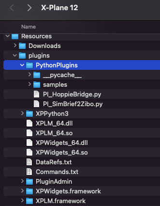
    - launch X-Plane 12 open the Simbrief2Zibo OFP Details from the plugin menu.\
    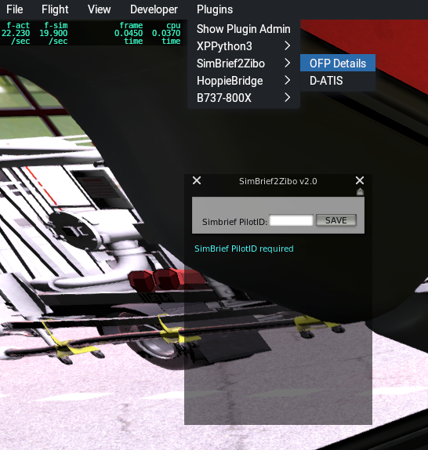
    - insert your _Simbrief Pilot ID_ (not your password) and save\
    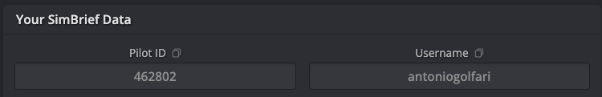
    - if you created an OFP in the latest 2 days, it will be automatically recognized each time Zibo is loaded, and all files created.\
    The script has also a D-ATIS widget, for the airports with public D-ATIS available.\
    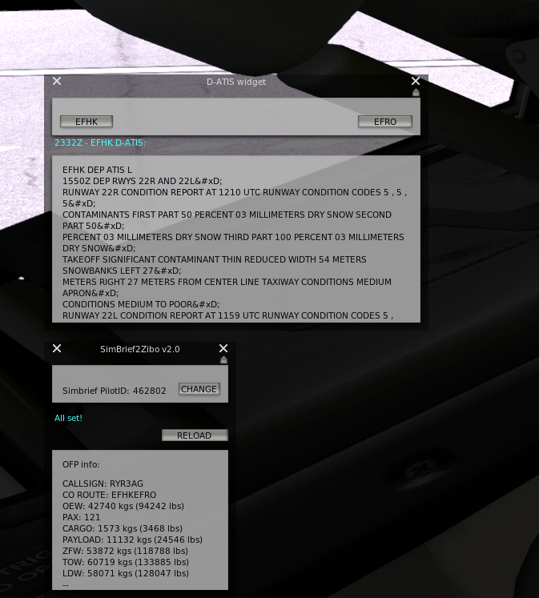

4. ### ZiboWindshield script
    When started in Cold and Dark situation, and weather conditions are prone to ice formation, windshield will be fully covered with ice at startup, adding immersion and realism.
    - [download latest stable version](https://github.com/biuti/ZiboWindshield/releases)
    - unzip the archive and move the file _PI_ZiboWindshield.py_ to the PythonPlugins folder (that's the only file in the zip file you need)\
    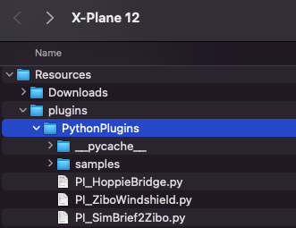
    - the plugin doesn't have a widget, it does simply detect the aircraft and apply ice on windshield if conditions are met.\
    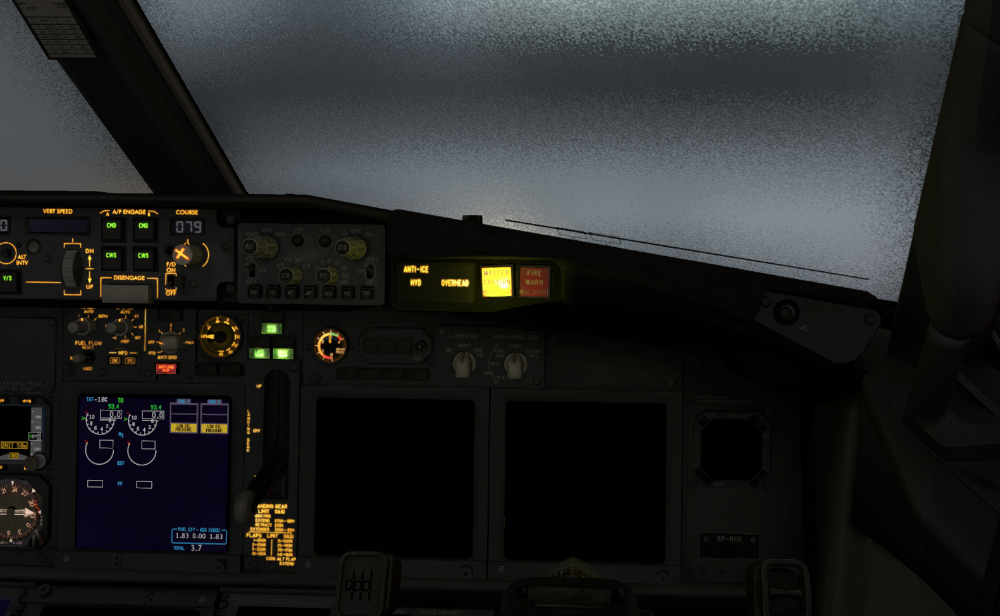

5. ### ZiboCabinTemp script
    As soon as boarding starts, flight assistant will start to report passengers' complains about cabin temperature if it's far from comfort temperature selected in settings (default 21°C).
    If pre-flight procedures are done correctly, you'll forget to have this installed.
    - [download latest stable version](https://github.com/biuti/ZiboCabinTemp/releases)
    - unzip the archive and move the file _PI_ZiboWindshield.py_ to the PythonPlugins folder (that's the only file in the zip file you need)\
    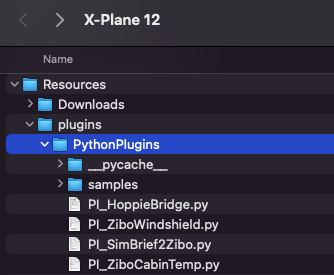
    - in the script widget you can change the comfort temperature, and wether or not FA will call you by interphone\
    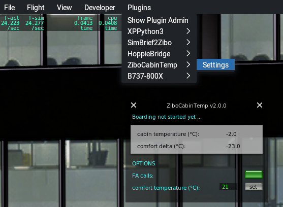

6. ### NOAAWeather script
    This plugin has been originally developed for X-Plane 11, to add _"Real Weather"_ getting info from NOAA. Now X-Plane has its own Real Weather, but this plugin is still very useful:
    - Adds snow cover using GFS data information
    - monitors XP12 real weather behavior
    - METAR query window that displays both from XP12 Real Weather and chosen source (NOAA, IVAO or VATSIM servers)

    
    - [download latest version](https://github.com/biuti/XplaneNoaaWeather/releases). At the time I wrote this guide, latest version for XP12.4 is still in beta, but it's stable.
    - unzip the archive and move the file _PI_noaaWeather.py_ and the _noaaweather_ folder to the PythonPlugins folder.\
    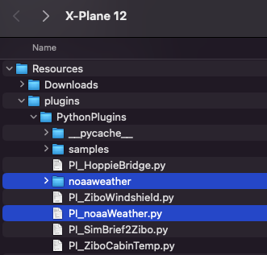
    - you will have three widget available in the XP NOAAWeather menu:

        - Weather Info: the monitor widget where you can follow all Real Weather parameters, values, created layers
        - Metar Query: a widget to request METAR for a ICAO code, it will show the METAR Real Weather is using, and the one from a selectable source among NOAA, IVAO or VATSIM
        - Configuration: the settings widget, I recommend to use the settings in the picture, just choose METAR source you prefer and the METAR decoding feature if you need it

    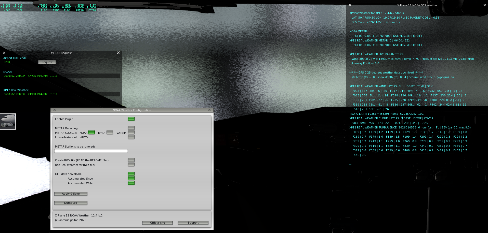

***
## Mandatory plugins

7. ### Terrain Radar
    This plugin adds two features you don\'t want to miss:

    - a synthetic terrain radar, based on geodata
    - a Vertical Situation Display (VSD)

    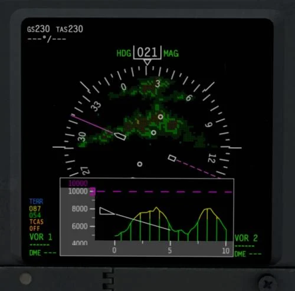

    - [download latest version](https://forums.x-plane.org/files/file/37864-terrain-radar-vertical-situation-display/) from the website
    - unzip the archive and move the _TerrainRadar_ folder in _plugins_ folder\
    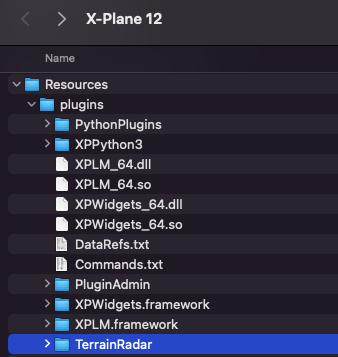

8. ### X-RAAS2
    this plugin add the RAAS functionality

    - [download the latest version](https://github.com/olivierbutler/X-RAAS2-xp12/releases) of the plugin
    - unzip the archive and move _X-RAAS2_ folder in _plugins_ folder\
    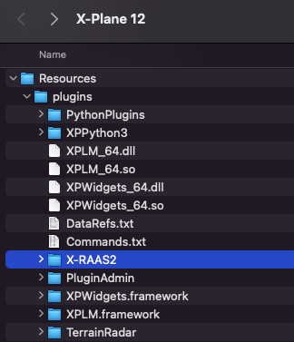

    - X-RAAS2 will create the necessary files in _preferences_ folder first time XP12 is launched. But I suggest to use this ones, are tested and work very well:
        - [Zibo configuration](files/config/X-RAAS_B737-800X.cfg)
        - [overlay configuration](files/config/ND_overlays.cfg)

        move both files to XP12 _Output/preferences_ folder

9. ### Better Pushback Mod
    this plugin simulates pushback procedures, with ground to cockpit comunications, animations, and many different configurations.

    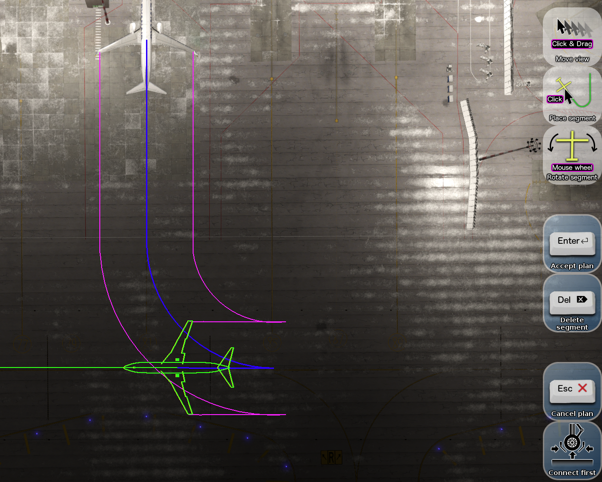
    

    - [download the latest version](https://github.com/olivierbutler/BetterPusbackMod/releases) of the plugin
    - unzip the archive and move _BetterPushback_ folder in _plugins_ folder

    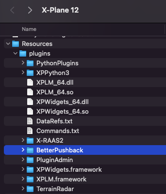
    - as written in the readme, copy the file _BetterPushback_doors.cfg_ from the plugin folder to _Output/preferences_ folder
    - this are the settings I'm using. As always, YMMV:

    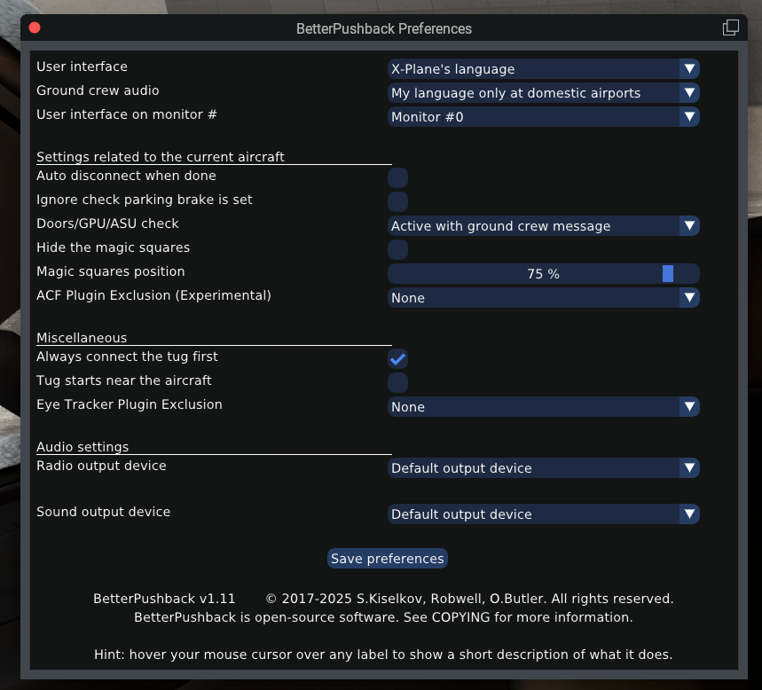

10. ### AviTab
    another must have, AviTab is fully integrated in Zibo EFB, and gives a lot of information about airports, procedures, charts, it is able to display pdf files in the EFB.
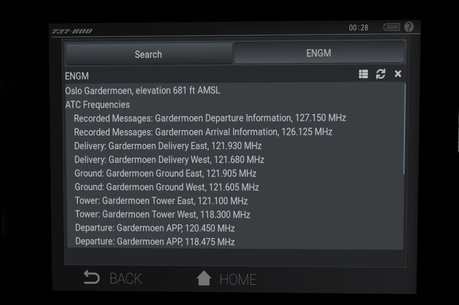
    - [download the latest version](https://github.com/fpw/avitab/releases) of the plugin
    - unzip the archive and move _AviTab_ folder in _plugins_ folder\ 
    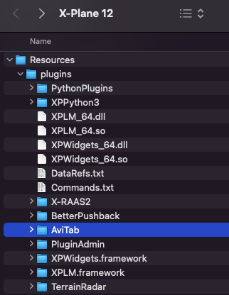

***
## Optional plugins

11. ### AutoDGS
    a very nice to have, adds marshallers at stands and gates, or the safedock T2 monitor if jetway is available.\
    It can also be customized to reflect exactly what's available at each stand.

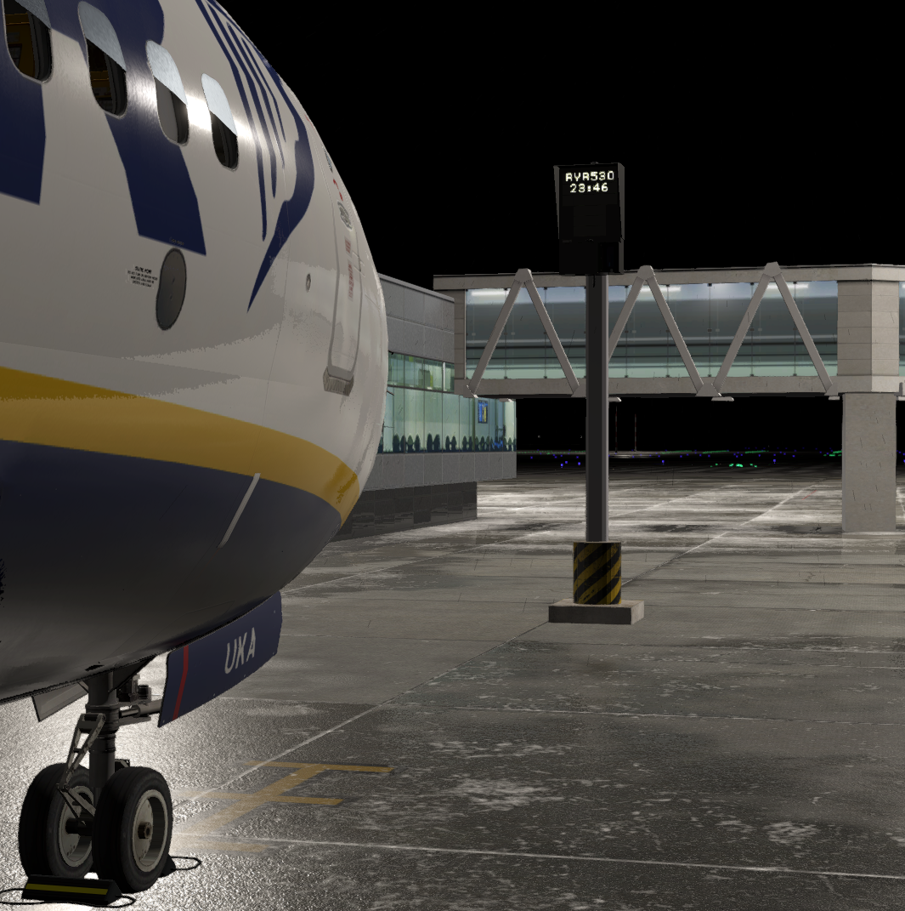
    - [download the latest version](https://github.com/hotbso/AutoDGS/releases) of the plugin
    - unzip the archive and move _AviTab_ folder in _plugins_ folder\ 

12. ### HeadShake
    This plugin adds in my opinion a lot of immersion, moves the POV using forces, aircraft attitude and / or natural unconscious head movement to keep the horizon.
    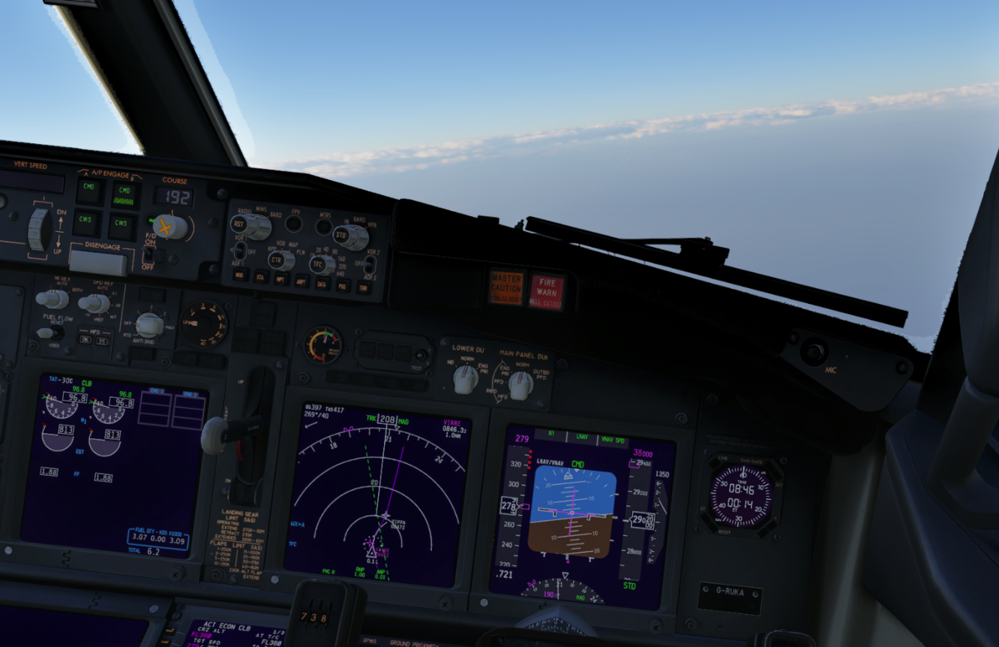

    - [download the latest version](https://www.simcoders.com/headshake/headshake/) of the plugin
    - unzip the archive and move _HeadShake_ folder in _plugins_ folder.

    From version 1.14 HeadShake is compatible with new XP12.2+ G-Loaded camera feature.\

    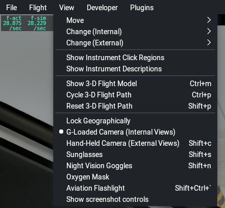

    After some tests I choose to use that feature and leave to HeadShake the other effects.\
    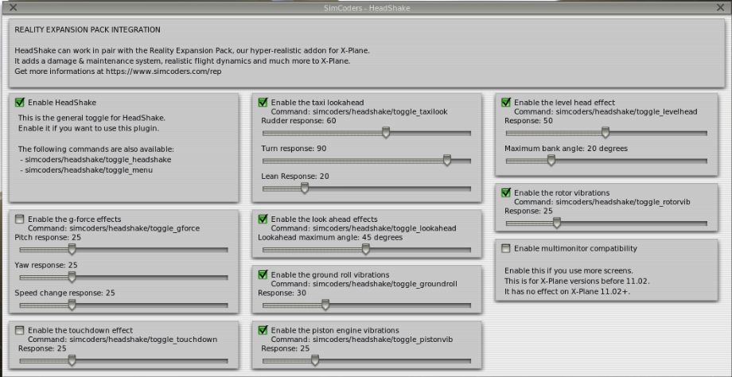

13. ### X-Camera
    another great add-on, I know most of the features could be achieved also using built-in XP12 camera features, but I find much easier to configure and a lot more integrated with my setup, for example HeadShake.
    It permits to have Fixed cameras without G-Force or HeadShake effects, fixed zoom values, seamless transition effects.

    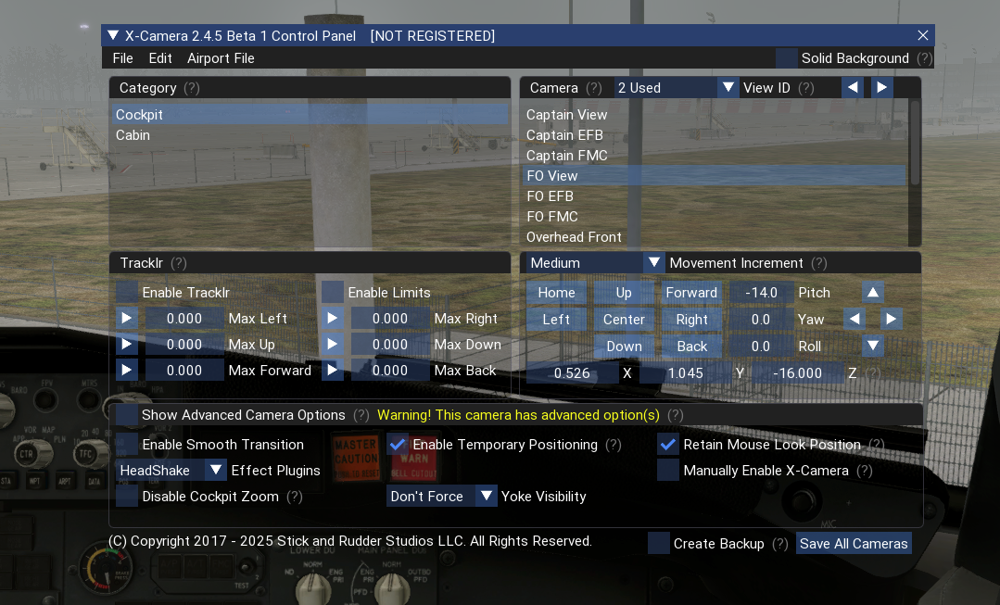

    - [download the latest version](https://stickandrudderstudios.com/x-camera/) of the plugin
    - unzip the archive and move _X-Camera_ folder in _plugins_ folder.

    First time you run X-Plane it will create a config file in the aircraft folder. It is highly customizable so at the beginning you will need some time to setup everything.\
    My suggestion is to [download my X-Camera settings file](files/config/X-Camera_b738.csv) for the Zibo, move it to the Zibo folder, start X-Plane 12, open X-Camera setting widget and start from my settings to create ours.\
    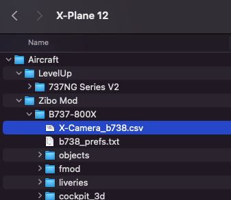


